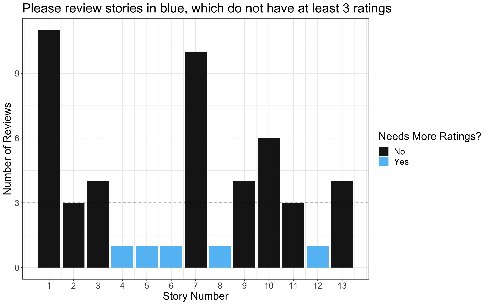

## Head Middle Magnet 2021 Interactive Fiction Showcase

> These stories were crafted by 5th and 6th grade students at [Head STEAM Magnet](https://schools.mnps.org/head-middle-magnet-prep) in Nashville, TN using [Twine](https://www.twinery.org). These are all submissions for our first Interactive Fiction Competition.

> Students all had to start with the same prompt: "Sam had warned her a thousand times, but she never listened." Their choose-your-own-adventure games diverge from there, going in totally unexpected, creative directions!

> Public voting will be open from Mon Jan 25 to Wed Jan 27 (3pm). This will determine the top 5 semifinalists which will proceed to a final round. The Top 5 will receive certificates of their achievement; Top 3 will receive $20 gift certificates; and the overall winner will receive an engraved award!

### Stories
---

---

1. [**"The Chosen One"** by Goat with a Coat (Grade 5)](voting-pages/01.md)
2. [**"Avalanche"** by Hannah Rodriguez (Grade 6)](voting-pages/02.md)
3. [**"The Eagle is Rising"** by Anonymous (Grade 5)](voting-pages/03.md)
4. [**"Sam and Lily"** by Anonymous (Grade 6)](voting-pages/04.md)
5. [**"The Picture"** by Liesl Wilson (Grade 6)](voting-pages/05.md)
6. [**"Destination: Earth"** by Asher Lee Koehn Burnette (Grade 5)](voting-pages/06.md)
7. [**"The Cave Adventure"** by Simon Dowell (Grade 5)](voting-pages/07.md)
8. [**"Work Problems"** by KMA (Grade 5)](voting-pages/08.md)
9. [**"Camping"** by Zachariah C. Diaz (Grade 5)](voting-pages/09.md)
10. [**"The House..."** by Jayden Alex Manoj (Grade 5)](voting-pages/10.md)
11. [**"The Cabin"** by Ty Hathaway (Grade 5)](voting-pages/11.md)
12. [**"Crazy Farm Day"** by Rowan Austin (Grade 5)](voting-pages/12.md)
13. [**"The Midnight Adventure"** by Helen Lundy (Grade 5)](voting-pages/13.md)

----
###Public Voting is Open until 3pm Central, January 26th, 2021!
----
#### After playing a few of the games, be sure to review and provide feedback to the authors using the link under each story. Ratings on creativity, grammar/punctuation/spelling, and engagement will determine the winners. Enjoy!
 
 
