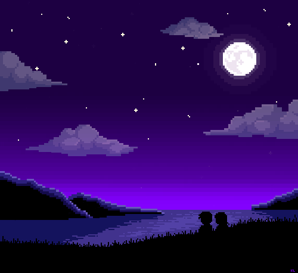

<h1 align="center">❀ ❀ ❀ ❀ ❀ ❀ ❀ ❀ ❀ ❀ ❀ ❀ ❀ ❀ ❀ ❀ ❀ 
2021 Head Interactive Fiction Awards 
❀ ❀ ❀ ❀ ❀ ❀ ❀ ❀ ❀ ❀ ❀ ❀ ❀ ❀ ❀ ❀ ❀ 
</h1>

#### We are very proud of all our students who submitted Twine games for this competition! They worked for several weeks on crafting short stories, which they translated into the [Twine](http://twinery.org/) format and then began to branch off, adding multiple endings and rich world-building details. They went through multiple rounds of revision, including a round of peer review. All entrants will receive detailed feedback from at least 3 reviewers to help them create even richer stories in the future.

#### Semifinalists (who will all receive certificates of their achievement) were decided by over 80 votes from middle and high school students and the general public.

#### Finalists (and the overall winner) were decided by two professional writers [Tahlia Kirk](https://www.amazon.com/Tahlia-Kirk/e/B081B7ZFMQ%3Fref=dbs_a_mng_rwt_scns_share) and [Dana Fraedrich](https://www.amazon.com/Out-Shadows-Broken-Gears-Book-ebook/dp/B01JHY3A6A/), who served on our judging panel. The 3 finalists will receive Amazon gift certificates, and the overall winner, Hannah Rodriguez, will receive an engraved award.

| Level | Award | Author | Story |
| ---   | ---   | ---   | ---   |
| Finalist| Overall Winner| Hannah Rodriguez | ["Avalanche"](stories/02.md)|
| Finalist| Spine-Tingler Award|Goat with a Coat | ["The Chosen One"](stories/01.md)|
|Finalist| Creativity Award| Liesl Wilson| ["The Picture"](stories/05.md)|
|Semifinalist| People's Choice Award| Jayden Alex Manoj| ["The House"](stories/10.md)|
|Semifinalist| Suspense Award| Ty Hathaway | ["The Cabin"](stories/11.md)|
|Semifinalist| Plot Design Award |Simon Dowell | ["The Cave Adventure"](stories/07.md)|
|Semifinalist| Plot Twist Award |Zachariah C. Diaz | ["Camping"](stories/09.md)|

# Very well done all!
Now, go back and play [all the submitted games](index.md) in our showcase! Many have unexpected twists and alternate endings that reward multiple play-throughs. Enjoy :)

